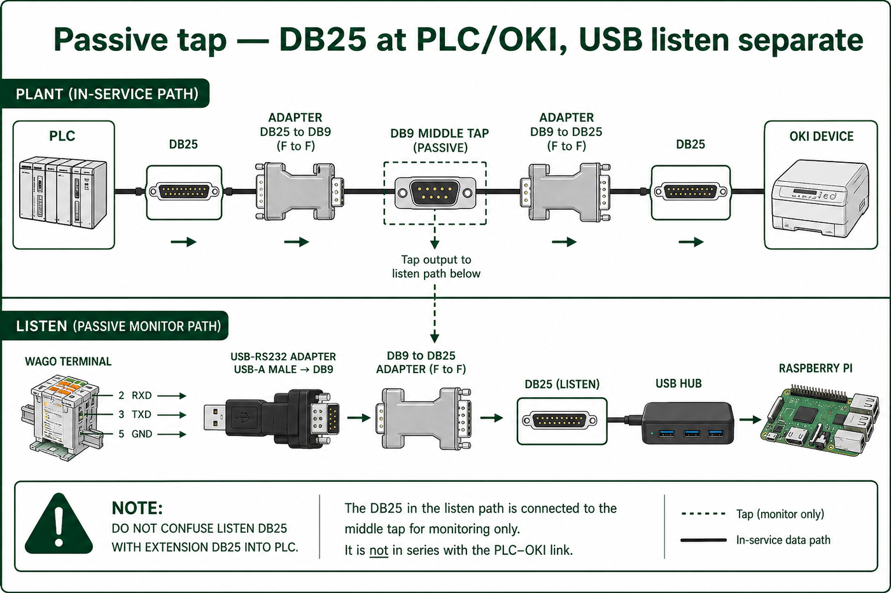
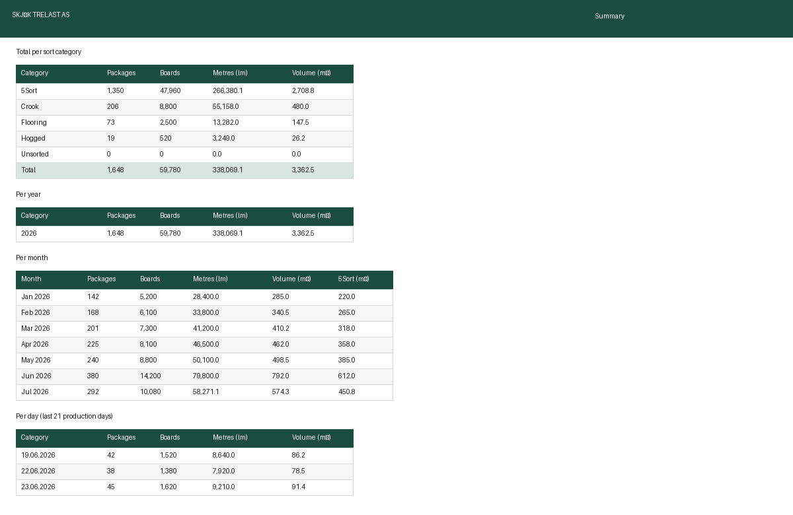
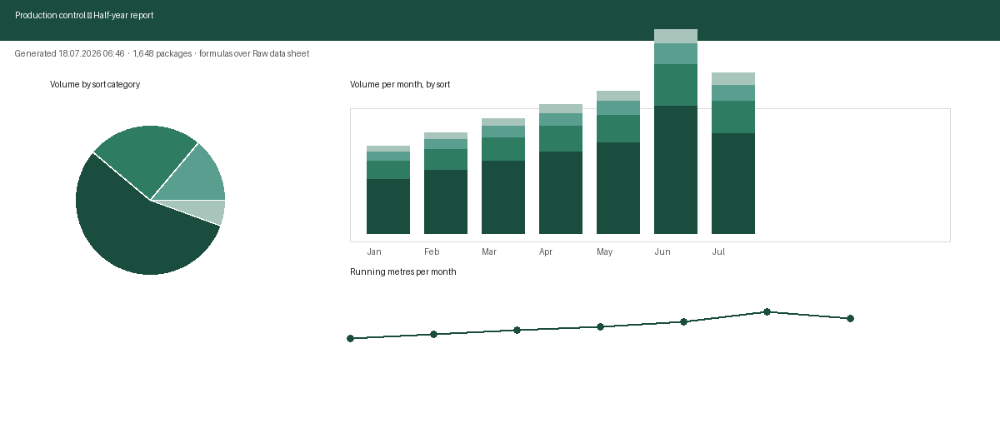
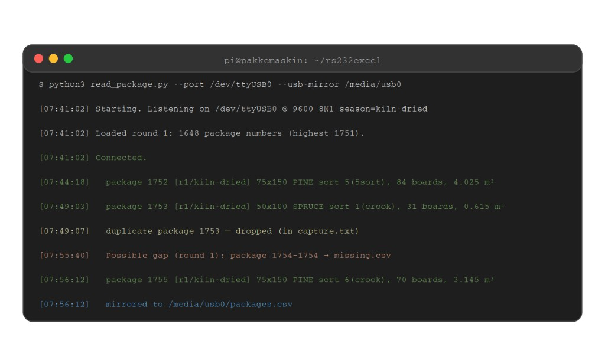
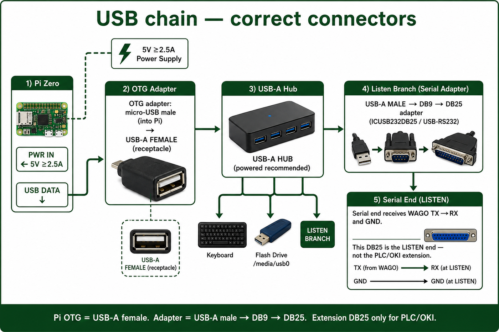
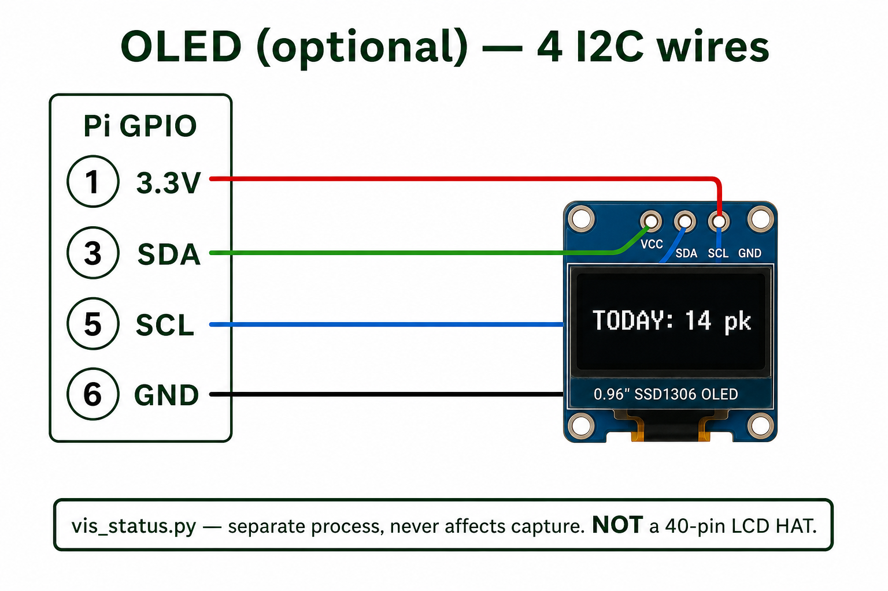

<p align="center">
  <a href="https://www.skjak-trelast.no">
    
  </a>
</p>

<p align="center">
  <a href="README.md" style="font-size: 1.45em; font-weight: 700">← Norsk Readme (hovedversjon)</a>
</p>

<h1 align="center">rs232excel</h1>

<p align="center" style="font-size: 1.1em">
  <b>Passive serial tap · Telemecanique TSX → OKI Microline → CSV & Excel</b>
</p>

<p align="center">
  
  
  
  
</p>

<p align="center" style="font-size: 1.05em">
  <b>🇬🇧 English translation</b> — the project is built and maintained primarily for
  <a href="README.md"><b>Scandinavian sawmills (Norwegian version →)</b></a>
</p>

<p style="font-size: 1.05em">
A Raspberry Pi listens silently on the RS-232 line between a 1980s Telemecanique TSX PLC and an OKI Microline 280 dot-matrix printer at a Norwegian sawmill. Every timber package label is parsed and stored automatically — dimension, species, grade, board count, volume. No manual entry. No data loss, even when the printer is off.
</p>


The tap is **physically read-only**: only TX+GND via WAGO; TX → ICUSB232DB25 **RX**. Signal to `/dev/ttyUSB0`, not GPIO. The printer keeps printing as before.

---

## Choose your extension: DB25 or DB9

PLC and OKI use **DB25**. The jumper between them can be either:

| Extension you buy | Where you tap | TX | GND |
|---|---|---|---|
| **Full DB25** M→F | Open the jacket mid DB25 cable | pin **2** | pin **7** |
| **DB9 cable** with a DB25 adapter on each end *(common purchase)* | Open the jacket on the **DB9** middle | DB9 pin **3**<br/>(= DB25 pin 2) | DB9 pin **5**<br/>(= DB25 pin 7) |

Both are correct — same signals. **Do not cut the whole cable**, only those two conductors. **Wire colors are not standard**: find TX/GND with a continuity tester from the DB25 end (pins 2 and 7) before cutting. Then WAGO (three-way) → StarTech **ICUSB232DB25** (TX→RX). Details: [docs/en/wiring.md](docs/en/wiring.md).



---

## Daily use on the Pi

After the Norwegian production install (`python/no`), HDMI shows a number menu (no login). Same actions work as one-word commands over SSH.

**First time / after rewiring** — confirm hardware before saving:

1. **USB** — hub, keyboard, stick, and serial adapter visible? Stick mounted?
2. **Sjekk** — dry-run one package through the plant (shown on screen, **not** saved).
3. **Logg** — once capture is running: live messages (**Ctrl+C** returns to the menu).

**Normal shift** — keep the service running:

5. **Start** — save packages (SD + mirror to stick)  
6. **Stopp** — end of shift / before troubleshooting  
7. **Restart** — if the service hangs, or after swapping USB cable/adapter  
8. **Excel** — optional “refresh now” (Excel is also mirrored automatically)

```bash
usb            # list USB + integrity check (SD ↔ stick)
integritet     # verify / heal flash drive from SD master
start   stopp   restart   status
logg           # live log — Ctrl+C to stop
sjekk          # dry run (does not save)
excel          # refresh Excel now
```

Yearly files on SD/stick: `pakkelapperYYYY.csv` + `.xlsx` (updated in place; new year → new names).  
Primary docs: **[README.md](README.md)** · **[docs/no/INSTALLATION.md](docs/no/INSTALLATION.md)** · **[CHANGELOG.md](CHANGELOG.md)**

---

## Quick start

**Production (Skjåk / appliance CLI, USB mirror, yearly files):** use [`python/no/`](python/no/) — see Norwegian README.

**English script mirror** (`python/en/` — flags in English; USB appliance tooling lives in `python/no/`):

```bash
git clone https://github.com/qeamer/rs232excel.git
cd rs232excel/python/en
pip install -r requirements.txt
python3 read_package.py --port /dev/ttyUSB0
python3 read_package.py --export-xlsx
```

📖 **[Installation guide (English) →](docs/en/INSTALLATION.md)** · **[Installasjonsguide (norsk) →](docs/no/INSTALLATION.md)**

---

## What you get

<p align="center">


</p>

A branded Excel workbook — in Norwegian production it is built **automatically** during capture and mirrored to the stick (`pakkelapperYYYY.xlsx`). `excel` / `--export-xlsx` is optional “refresh now”:

- **Summary** sheet — totals per sort category, per day / month / year, with pie, stacked-bar, and line charts. All values are live formulas over the raw data.
- **One sheet per sort category** (5th Grade / Crooked / Floor / Rejected / No Category) — frozen headers, autofilter, per-dimension mini-summary
- **Raw data** sheet — every captured package, one flat table

## How the capture works



| Situation on the floor | What the software does |
|---|---|
| Operator presses confirm twice | **Dedup** — package stored once, raw copy kept in `utskrift.txt` / `capture.txt` |
| A package never gets confirmed | **Gap detection** — logged in `manglerYYYY.csv` / `missing.csv`; cleared when the package arrives |
| Counter rolls over 9999 → 0 | **Round** — only if max &gt; 9000 and the new number is low (mid-series reprint does **not** start a new round) |
| Printer is off / out of paper | Data is on the wire anyway — capture continues |
| Flash drive yanked mid-run | SD is master; stick syncs/heals on re-insert (`integritet` / fsync + atomic rewrite) |
| Label never printed at all | `--register N` / `--registrer N` — a later real label upgrades an empty manual row |
| PLC sends odd ESC sequences | Full Epson/IBM escape table; unknown codes logged, never corrupt data |

## Commands (English)

| Flag | Purpose |
|---|---|
| `--port /dev/ttyUSB0` | Live capture (production) |
| `--raw-capture` | Raw capture, nothing saved — first-run verification |
| *(USB mirror / `integritet`)* | Norwegian production: `--usb-sti` in [`python/no/`](python/no/) |
| `--set-season raw` / `kiln-dried` | Match the physical season toggle on the machine |
| `--export-xlsx` | Generate the Excel workbook |
| `--summary` | Daily totals in the terminal |
| `--register 1234` | Manual package entry |
| `--simulate example.txt` | Offline test — no PLC needed |

Norwegian production flags (`--bare-fangst`, `--eksporter-xlsx`, …): see [`python/no/`](python/no/).

## Hardware

Raspberry Pi Zero WH · StarTech ICUSB232DB25 · WAGO 221 · extension (DB25 *or* DB9+adapters) ·
USB hub + keyboard + flash drive · optional SSD1306 OLED.
Full parts list in the [installation guide](docs/en/INSTALLATION.md).

<p style="font-size: 15px; margin-bottom: 0.4em"><b>1 · Passive tap</b> — see <a href="#choose-your-extension-db25-or-db9">Choose your extension</a> (image above).</p>

<p style="font-size: 15px; margin-bottom: 0.4em"><b>2 · USB chain</b> — Pi OTG: micro-USB → USB-A <b>female</b>. Listen adapter: USB-A <b>male</b> → DB9 → DB25 (WAGO on serial end). Hub with keyboard + stick. PWR IN ≥2.5 A.</p>


<p style="font-size: 15px; margin-bottom: 0.4em"><b>3 · OLED (optional)</b> — 0.96" SSD1306 I2C, four wires. Rotates day/year, last package, sort mix.</p>


## Label format

```
   645                      75X 150     ← package no · dimension
   2026/ 6/22                5          ← date · sort digit
                            FURU        ← species (FURU=pine, GRAN=spruce)
              25            0           ← board count
             108,7          0,0         ← total length (running metres)
             1,223          0,000       ← volume (m³)
              43            0,0         ← avg length (dm)
```

## Project structure

```
docs/no/       ← primary docs (Norwegian)
docs/en/       ← English translation
python/no/     ← production code at Skjåk Trelast
python/en/     ← English mirror for GitHub / international use
```

## License

MIT

---

<p align="center">
  <sub><a href="https://www.skjak-trelast.no">Skjåk Trelast AS</a> · Telemecanique TSX · OKI Microline · RS-232 9600 8N1</sub>
</p>
