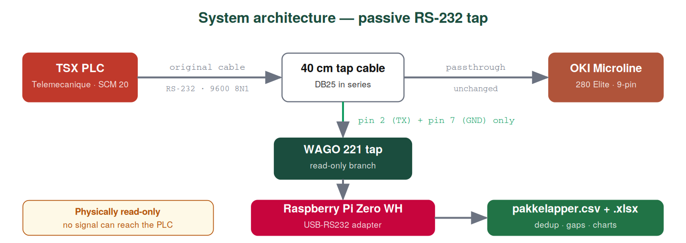
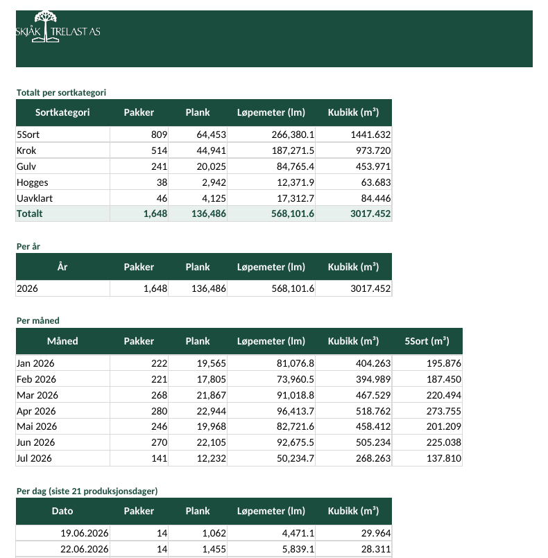

<p align="center">
  
</p>

<p align="center">
  <a href="README.en.md"><b>English Readme Here</b></a>
</p>

<h1 align="center">rs232excel</h1>

<p align="center">
  <b>Passiv serieport-tapp · Telemecanique TSX → OKI Microline → CSV og Excel</b>
</p>

<p align="center">
  
  
  
  
</p>

<p align="center">
  <big><b>🇳🇴 HOVEDVERSJON — FOR SKANDINAVISKE SAGBRUK</b></big>
</p>

<p align="center">
  <big>
  Dette prosjektet er laget for sagbruk i <b>Norge, Sverige og Danmark</b>.<br>
  Norsk er standardspråk for programvare, dokumentasjon og Excel-eksport.
  </big>
</p>

---

<p style="font-size: 17px; line-height: 1.55">
En Raspberry Pi lytter <b>passivt</b> på RS-232-linja mellom en Telemecanique TSX PLS
(1980-tall) og en OKI Microline 280 nåleskriver. Hver pakkelapp parses og lagres automatisk —
dimensjon, treslag, sort, antall plank, kubikk. Ingen manuell registrering. Ingen datatap,
selv når skriveren er av.
</p>



<p style="font-size: 16px; line-height: 1.5">
Tappen er <b>fysisk skrivebeskyttet</b>: kun pinne 2 (TX) og pinne 7 (GND) grener av via WAGO
midt på kabelen. Skriveren fortsetter helt som før — ingenting sendes tilbake mot PLS-en.
</p>

---

<h2 style="font-size: 1.5em">Hurtigstart (norsk produksjonsversjon)</h2>

```bash
git clone https://github.com/qeamer/rs232excel.git
cd rs232excel/python/no
pip install -r requirements.txt
python3 read_package.py --port /dev/ttyUSB0 --usb-sti /media/usb0
python3 read_package.py --eksporter-xlsx
```

<p style="font-size: 16px">
📖 <b><a href="docs/no/INSTALLATION.md">Installasjonsguide med koblingsdiagram →</a></b><br>
&nbsp;&nbsp;&nbsp; Engelsk guide: <a href="docs/en/INSTALLATION.md">docs/en/INSTALLATION.md</a>
</p>

---

<h2 style="font-size: 1.5em">Det du får</h2>

<p align="center">


</p>

<p style="font-size: 16px; line-height: 1.55">
Merkeprofilert Excel-arbeidsbok, generert på kommando fra live CSV:
</p>

<ul style="font-size: 16px; line-height: 1.6">
<li><b>Sammendrag</b> — totaler per sort, per dag / måned / år, med kake-, stablet søyle- og linjediagram</li>
<li><b>Ett ark per sortkategori</b> (5Sort / Krok / Gulv / Hogges / Uavklart) — frosne overskrifter, autofilter</li>
<li><b>Rådata</b> — hver fanget pakke, flat tabell</li>
</ul>

<h2 style="font-size: 1.5em">Slik fungerer fangsten</h2>


<table style="font-size: 16px">
<tr><th>Situasjon på gulvet</th><th>Hva programmet gjør</th></tr>
<tr><td>Operatør trykker kvittering to ganger</td><td><b>Dedup</b> — pakke lagres én gang, råkopi i <code>utskrift.txt</code></td></tr>
<tr><td>Pakke aldri kvittert</td><td><b>Hull-deteksjon</b> — manglende numre i <code>mangler.csv</code></td></tr>
<tr><td>Teller nullstiller 9999 → 0</td><td><b>Runde</b> — oppdages automatisk</td></tr>
<tr><td>Skriver av / tom for papir</td><td>Data ligger på kabelen uansett</td></tr>
<tr><td>Minnepenn trukket ut</td><td>SD-kort er fasit; minnepenn synkes ved ny tilkobling</td></tr>
<tr><td>Lapp aldri skrevet ut</td><td><code>--registrer N</code> legger inn manuelt</td></tr>
</table>

<h2 style="font-size: 1.5em">Kommandoer (norsk)</h2>

<table style="font-size: 16px">
<tr><th>Flag</th><th>Formål</th></tr>
<tr><td><code>--port /dev/ttyUSB0</code></td><td>Live fangst (produksjon)</td></tr>
<tr><td><code>--usb-sti /media/usb0</code></td><td>Speil CSV til minnepenn i sanntid</td></tr>
<tr><td><code>--bare-fangst</code></td><td>Bare vis rådata — verifiser første gang</td></tr>
<tr><td><code>--sett-sesong rå</code> / <code>tørr</code></td><td>Match sesongbryter på maskinen</td></tr>
<tr><td><code>--eksporter-xlsx</code></td><td>Generer Excel-arbeidsbok</td></tr>
<tr><td><code>--oppsummering</code></td><td>Daglige totaler i terminalen</td></tr>
<tr><td><code>--registrer 1234</code></td><td>Manuell pakke</td></tr>
<tr><td><code>--simuler eksempel.txt</code></td><td>Offline test — uten PLS</td></tr>
</table>

<h2 style="font-size: 1.5em">Hardware</h2>


<p style="font-size: 16px">
Raspberry Pi Zero WH · StarTech ICUSB232DB25 · WAGO 221-412 · 40 cm DB25 skjøtekabel i serie ·
IP54 kapsling · valgfri SSD1306 OLED. Full delerliste i
<a href="docs/no/INSTALLATION.md">installasjonsguiden</a>.
</p>

<h2 style="font-size: 1.5em">Mapper i repoet</h2>

<table style="font-size: 16px">
<tr><th>Mappe</th><th>Innhold</th><th>Prioritet</th></tr>
<tr><td><code>python/no/</code></td><td>Produksjonskode — Skjåk Trelast</td><td><b>⭐ Start her</b></td></tr>
<tr><td><code>docs/no/</code></td><td>Installasjon og kobling (norsk)</td><td><b>⭐ Start her</b></td></tr>
<tr><td><code>python/en/</code></td><td>Engelsk speilversjon</td><td>Oversettelse</td></tr>
<tr><td><code>docs/en/</code></td><td>Installation guide (English)</td><td>Oversettelse</td></tr>
</table>

---

<p align="center" style="font-size: 14px">
<a href="https://www.skjaaktrelast.no">Skjåk Trelast AS</a> · Telemecanique TSX · OKI Microline · RS-232 9600 8N1
</p>
