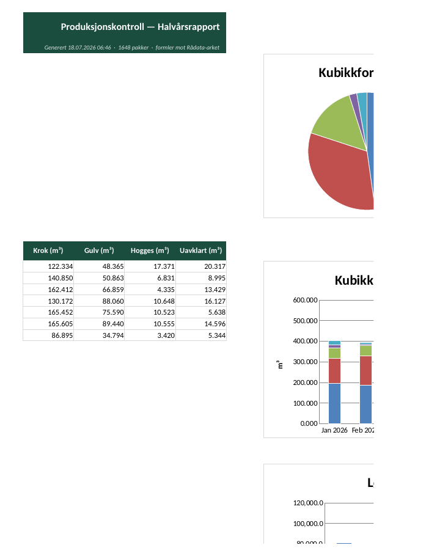
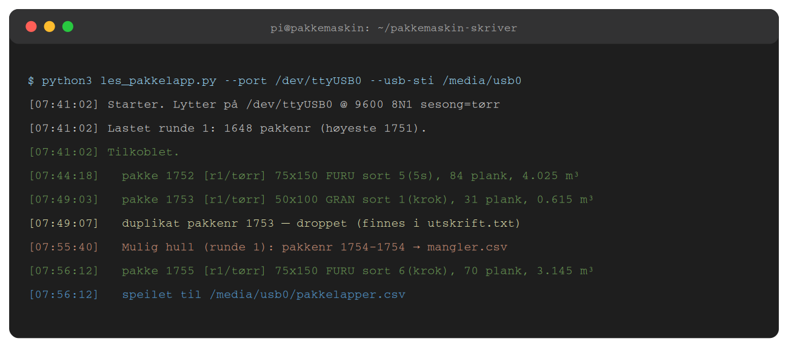
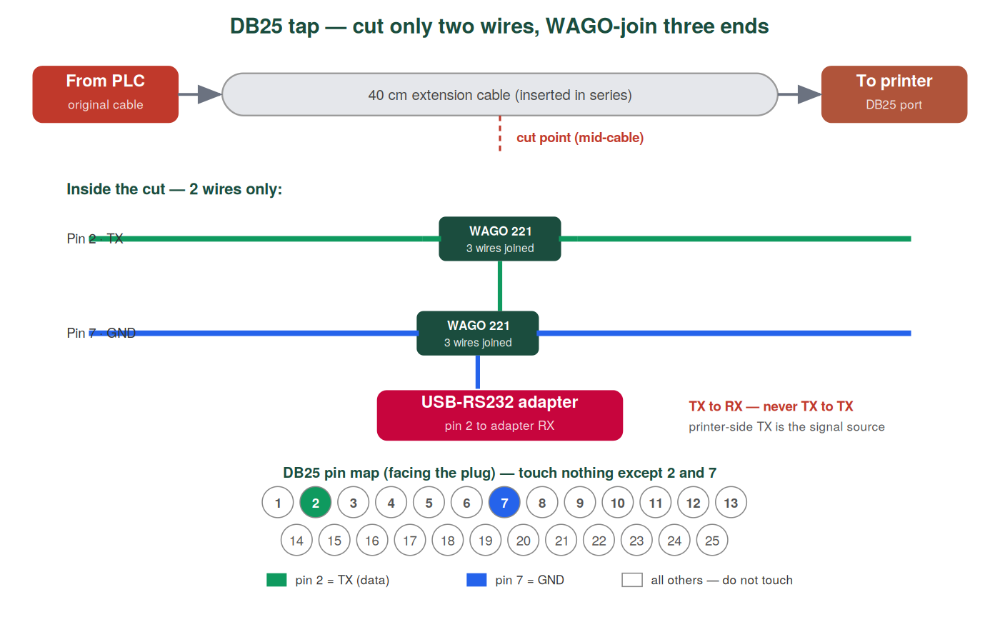

<p align="center">
  
</p>

<h1 align="center">rs232excel</h1>

<p align="center">
  <b>Passive serial tap · Telemecanique TSX → OKI Microline → CSV & Excel</b>
</p>

<p align="center">
  
  
  
  
</p>

A Raspberry Pi listens silently on the RS-232 line between a 1980s Telemecanique TSX PLC and an OKI Microline 280 dot-matrix printer at a Norwegian sawmill. Every timber package label is parsed and stored automatically — dimension, species, grade, board count, volume. No manual entry. No data loss, even when the printer is off.


The tap is **physically read-only**: only pin 2 (TX) and pin 7 (GND) are branched via WAGO clamps mid-cable. The printer keeps printing exactly as before, and nothing can be transmitted back toward the PLC.

---

## Quick start

```bash
pip install -r requirements.txt
python3 les_pakkelapp.py --port /dev/ttyUSB0 --usb-sti /media/usb0
python3 les_pakkelapp.py --eksporter-xlsx
```

📖 **[Full installation guide with wiring diagrams →](docs/INSTALLATION.md)**

---

## What you get

<p align="center">


</p>

A branded Excel workbook, generated on demand from the live CSV:

- **Sammendrag** sheet — totals per sort category, per day / month / year, with pie, stacked-bar, and line charts. All values are live formulas over the raw data.
- **One sheet per sort category** (5Sort / Krok / Gulv / Hogges / Uavklart) — frozen headers, autofilter, per-dimension mini-summary
- **Rådata** sheet — every captured package, one flat table

## How the capture works



| Situation on the floor | What the software does |
|---|---|
| Operator presses confirm twice | **Dedup** — package stored once, raw copy kept in `utskrift.txt` |
| A package never gets confirmed | **Gap detection** — missing numbers logged to `mangler.csv` |
| Counter rolls over 9999 → 0 | **Round tracking** — detected automatically, dedup/gaps scoped per round |
| Printer is off / out of paper | Data is on the wire anyway — capture continues |
| Flash drive pulled mid-run | SD card is the master; drive re-syncs missed rows on re-insert |
| Label never printed at all | `--registrer N` adds it manually |
| PLC sends odd ESC sequences | Full Epson/IBM escape table; unknown codes logged, never corrupt data |

## Commands

| Flag | Purpose |
|---|---|
| `--port /dev/ttyUSB0` | Live capture (production) |
| `--usb-sti /media/usb0` | Mirror CSV to flash drive in real time |
| `--bare-fangst` | Raw capture, nothing saved — first-run verification |
| `--sett-sesong rå` / `tørr` | Match the physical season toggle on the machine |
| `--eksporter-xlsx` | Generate the Excel workbook |
| `--oppsummering` | Daily totals in the terminal |
| `--registrer 1234` | Manual package entry |
| `--simuler eksempel.txt` | Offline test — no PLC needed |

## Hardware



Raspberry Pi Zero WH · StarTech ICUSB232DB25 · WAGO 221-412 clamps · 40 cm DB25 extension in series · IP54 enclosure · optional SSD1306 OLED status display. Full parts list with order numbers in the [installation guide](docs/INSTALLATION.md).

## Label format

```
   645                      75X 150     ← package no · dimension
   2026/ 6/22                5          ← date · sort digit
                            FURU        ← species (FURU=pine, GRAN=spruce)
              25            0           ← board count
             108,7          0,0         ← total length (running metres)
             1,223          0,000       ← volume (m³)
              43            0,0         ← avg length (dm)
```

The parser anchors on the decimal patterns (3-decimal = m³, 1-decimal = metres) rather than column positions — robust against spacing drift across label types. Verified against real photographed labels; volume cross-checks as width × height × total length on all of them.

## Project structure

```
les_pakkelapp.py              capture · parsing · CSV · Excel (single file, no services)
vis_status.py                 OLED status display (independent process)
installer.sh                  one-command systemd install
pakkemaskin-skriver.service   autostart unit
docs/INSTALLATION.md          illustrated step-by-step guide
eksempel.txt                  synthetic test labels for --simuler
```

## License

MIT

---

<p align="center">
  <sub><a href="https://www.skjaaktrelast.no">Skjåk Trelast AS</a> · Telemecanique TSX · OKI Microline · RS-232 9600 8N1</sub>
</p>
