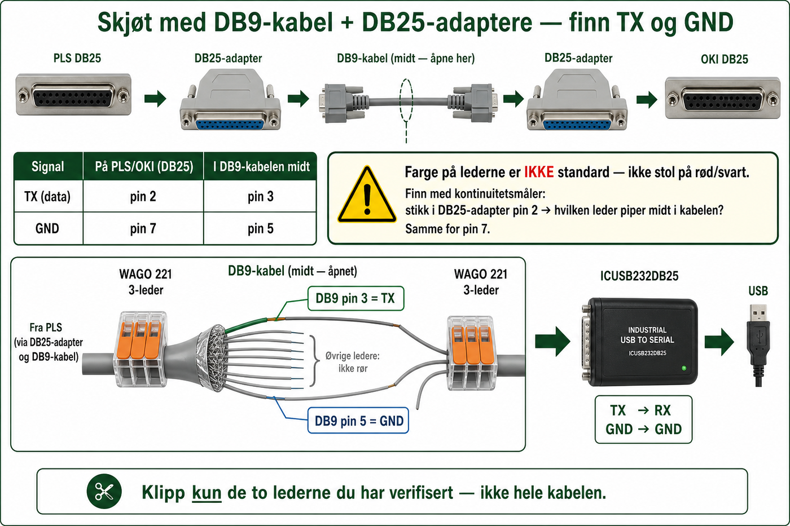
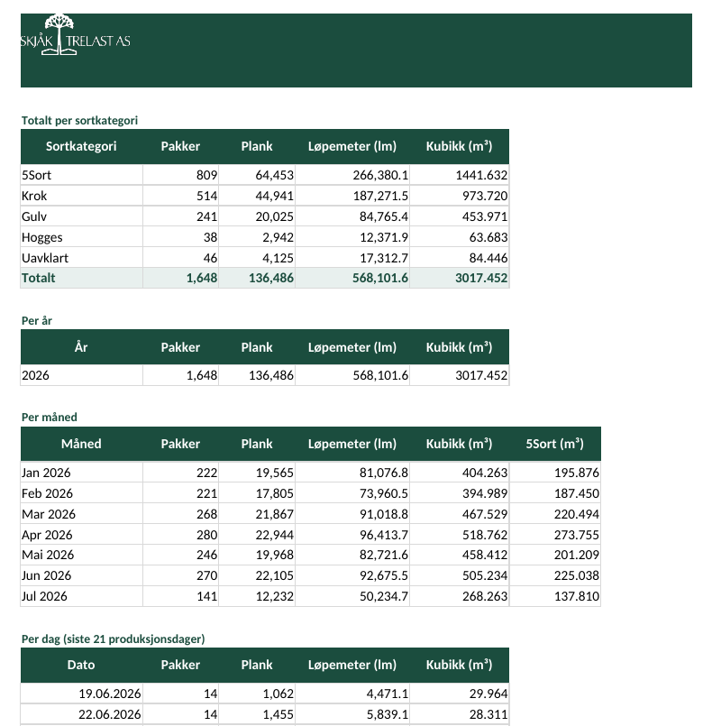
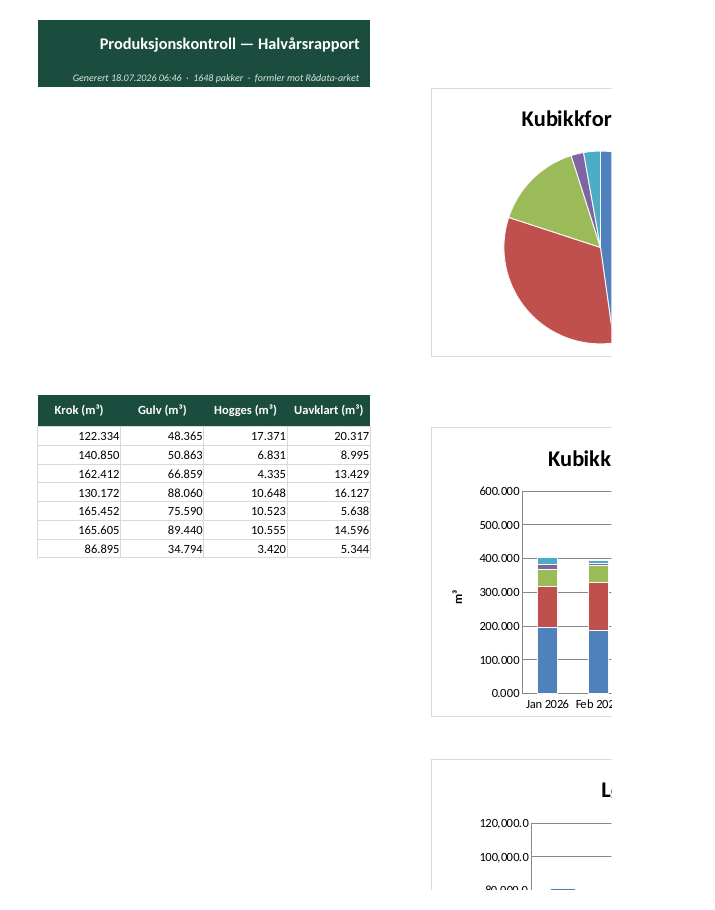
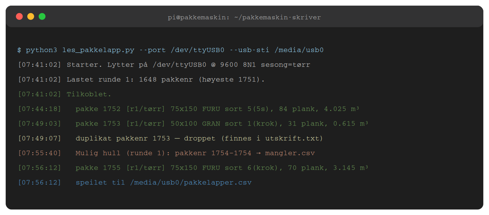
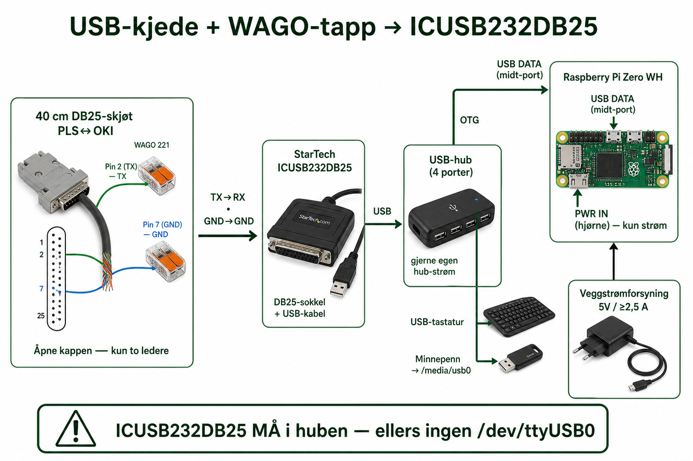
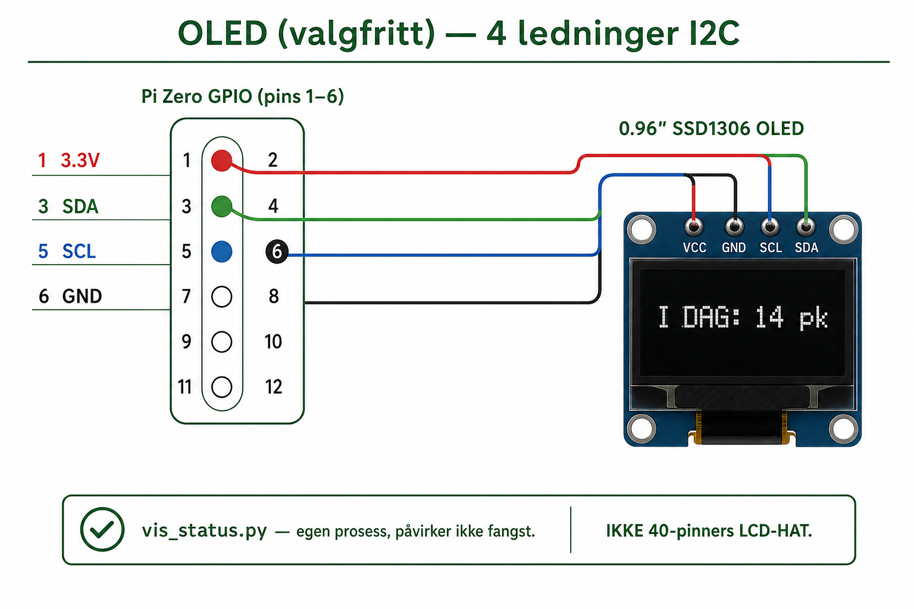

<p align="center">
  <a href="https://www.skjak-trelast.no">
    
  </a>
</p>

<p align="center">
  <a href="README.en.md" style="font-size: 1.45em; font-weight: 700">English Readme Here →</a>
</p>

<h1 align="center">rs232excel</h1>

<p align="center">
  <b>Passiv serieport-tapp · Telemecanique TSX → OKI Microline → CSV og Excel</b>
</p>

<p align="center">
  
  
  
  
</p>

<p align="center">
  <big><b>🇳🇴 HOVEDVERSJON — FOR SKANDINAVISKE SAGBRUK</b></big>
</p>

<p align="center">
  <big>
  Dette prosjektet er laget for sagbruk i <b>Norge, Sverige og Danmark</b>.<br>
  Norsk er standardspråk for programvare, dokumentasjon og Excel-eksport.
  </big>
</p>

---

## Daglig bruk på Pi — husk bare dette

Etter install er Pi-en et **apparat**: HDMI viser tallmeny med en gang (ingen `login:`).

**Første gang / etter kabelbytte** — sjekk at utstyret lever, før du lagrer noe:

1. **USB** — ser du hub, tastatur, minnepenn og serieadapter? Er pennen montert?
2. **Sjekk** — kjør én pakke gjennom anlegget. Lappen vises på skjermen, men lagres **ikke**.
3. **Logg** — når fangsten kjører: se live meldinger (**Ctrl+C** = tilbake til meny).

**Vanlig skift** — tjenesten skal bare gå:

5. **Start** — begynn å lagre pakker (SD + speil til penn)  
6. **Stopp** — når skiftet er over, eller før du feilsøker  
7. **Restart** — hvis tjenesten henger, eller du har byttet USB-kabel/adapter  
8. **Excel** — valgfri «oppdater nå» (Excel speiles også automatisk)

```text
1  USB          5  Start
2  Sjekk        6  Stopp
3  Logg         7  Restart
4  Status       8  Excel
```

Før du kopierer fra minnepennen til PC: skriv `integritet` (eller velg **1**).  
Filer på penn/SD: `pakkelapperYYYY.csv` + `.xlsx` (samme fil hele året).  
Endringslogg: **[CHANGELOG.md](CHANGELOG.md)**.

Samme ting som ett ord (SSH/skall): `usb` `integritet` `sjekk` `logg` `status` `start` `stopp` `restart` `excel`

Nød-login (hvis du trenger shell): **Alt+F2** · SSH: `ssh pi@pakkemaskin.local`

📖 Full guide: **[docs/no/INSTALLATION.md](docs/no/INSTALLATION.md)** · English: [docs/en/INSTALLATION.md](docs/en/INSTALLATION.md) · Endringslogg: [CHANGELOG.md](CHANGELOG.md)

---

## Første gangs installasjon

```bash
git clone https://github.com/qeamer/rs232excel.git
cd rs232excel/python/no
bash installer.sh          # PATH-kommandoer + tjeneste
bash fiks-usb.sh           # auto-mount minnepenn → /media/usb0
```

Deretter: `sjekk` → `start`. Før kopi til PC: `integritet`.

---

<p style="font-size: 17px; line-height: 1.55">
En Raspberry Pi lytter <b>passivt</b> på RS-232-linja mellom en Telemecanique TSX PLS
(1980-tall) og en OKI Microline 280 nåleskriver. Hver pakkelapp parses og lagres automatisk —
dimensjon, treslag, sort, antall plank, kubikk. Ingen manuell registrering. Ingen datatap,
selv når skriveren er av.
</p>


<p style="font-size: 16px; line-height: 1.5">
Tappen er <b>fysisk skrivebeskyttet</b>: kun TX+GND via WAGO, TX → ICUSB232DB25-<b>RX</b>.
Signal til <code>/dev/ttyUSB0</code>, ikke GPIO. Skriveren fortsetter som før.
</p>

---

<h2 style="font-size: 1.5em">Velg skjøtekabel: DB25 eller DB9</h2>

<p style="font-size: 16px; line-height: 1.55">
PLS og OKI har <b>DB25</b>. Skjøten mellom dem kan være enten:
</p>

<table style="font-size: 16px">
<tr><th>Skjøt du kjøper</th><th>Hvor du tapper</th><th>TX</th><th>GND</th></tr>
<tr>
  <td><b>Hel DB25</b> hann→hunn</td>
  <td>Åpne kappen midt på DB25-kabelen</td>
  <td>pin <b>2</b></td>
  <td>pin <b>7</b></td>
</tr>
<tr>
  <td><b>DB9-kabel</b> med DB25-adapter i hver ende<br/>(vanlig kjøp)</td>
  <td>Åpne kappen midt på <b>DB9</b>-delen</td>
  <td>DB9 pin <b>3</b><br/>(= DB25 pin 2)</td>
  <td>DB9 pin <b>5</b><br/>(= DB25 pin 7)</td>
</tr>
</table>

<p style="font-size: 16px; line-height: 1.55">
Begge er riktig — samme signal. <b>Klipp ikke hele kabelen</b>, bare de to lederne.
<b>Farger er ikke standard</b>: finn TX/GND med pipetest fra DB25-enden (pin 2 og 7)
før du klipper. Deretter WAGO (tre veier) → StarTech <b>ICUSB232DB25</b> (TX→RX).
Detaljer: <a href="docs/no/wiring.md">docs/no/wiring.md</a>.
</p>



---

<h2 style="font-size: 1.5em">Det du får</h2>

<p align="center">


</p>

<p style="font-size: 16px; line-height: 1.55">
Merkeprofilert Excel-arbeidsbok — bygges <b>automatisk</b> under fangst og speiles til
minnepennen (<code>pakkelapperYYYY.xlsx</code>). Meny <b>8</b> / <code>excel</code> er valgfri «oppdater nå»:
</p>

<ul style="font-size: 16px; line-height: 1.6">
<li><b>Sammendrag</b> — totaler per sort, per dag / måned / år, med kake-, stablet søyle- og linjediagram</li>
<li><b>Ett ark per sortkategori</b> (5Sort / Krok / Gulv / Hogges / Uavklart) — frosne overskrifter, autofilter</li>
<li><b>Rådata</b> — hver fanget pakke, flat tabell</li>
</ul>

<h2 style="font-size: 1.5em">Slik fungerer fangsten</h2>



<table style="font-size: 16px">
<tr><th>Situasjon på gulvet</th><th>Hva programmet gjør</th></tr>
<tr><td>Operatør trykker kvittering to ganger</td><td><b>Dedup</b> — pakke lagres én gang, råkopi i <code>utskrift.txt</code></td></tr>
<tr><td>Pakke aldri kvittert</td><td><b>Hull-deteksjon</b> — manglende numre i <code>manglerYYYY.csv</code> (friskmeldes når pakken kommer)</td></tr>
<tr><td>Teller nullstiller 9999 → 0</td><td><b>Runde</b> — kun når maks &gt; 9000 og nytt nr er lavt (reprint midt i serien starter ikke ny runde)</td></tr>
<tr><td>Skriver av / tom for papir</td><td>Data ligger på kabelen uansett</td></tr>
<tr><td>Minnepenn trukket ut</td><td>SD er fasit; penn synkes/helbredes ved ny tilkobling (<code>integritet</code>)</td></tr>
<tr><td>Lapp aldri skrevet ut</td><td><code>--registrer N</code> — ekte lapp senere oppgraderer tom manuell rad</td></tr>
</table>

<h2 style="font-size: 1.5em">Avanserte flag (valgfritt)</h2>

<p style="font-size: 16px">
Daglig bruk: se <b>Daglig bruk på Pi</b> øverst. Under er flag for direkte kjøring av
<code>python3 read_package.py …</code> om du trenger det.
</p>

<table style="font-size: 16px">
<tr><th>Flag</th><th>Formål</th></tr>
<tr><td><code>--port /dev/ttyUSB0</code></td><td>Live fangst (produksjon)</td></tr>
<tr><td><code>--usb-sti /media/usb0</code></td><td>Speil årets CSV + Excel til minnepenn</td></tr>
<tr><td><code>--sjekk-usb</code></td><td>Sjekk/helbred penn mot SD (samme som <code>integritet</code>)</td></tr>
<tr><td><code>--bare-fangst</code></td><td>Bare vis rådata — verifiser første gang</td></tr>
<tr><td><code>--sett-sesong rå</code> / <code>tørr</code></td><td>Match sesongbryter på maskinen</td></tr>
<tr><td><code>--eksporter-xlsx</code></td><td>Generer Excel nå (ellers automatisk)</td></tr>
<tr><td><code>--oppsummering</code></td><td>Daglige totaler i terminalen</td></tr>
<tr><td><code>--registrer 1234</code></td><td>Manuell pakke</td></tr>
<tr><td><code>--simuler eksempel.txt</code></td><td>Offline test — uten PLS</td></tr>
</table>

<h2 style="font-size: 1.5em">Hardware</h2>

<p style="font-size: 16px">
Raspberry Pi Zero WH · StarTech ICUSB232DB25 · WAGO 221 · skjøt (DB25 <i>eller</i> DB9+adaptere) ·
USB-hub + tastatur + minnepenn · valgfri SSD1306 OLED.
Full delerliste i <a href="docs/no/INSTALLATION.md">installasjonsguiden</a>.
</p>

<p style="font-size: 15px; margin-bottom: 0.4em"><b>1 · Passiv tapp</b> — se tabellen <b>Velg skjøtekabel</b> over. Diagram under viser DB9-midt + DB25-adaptere (vanligste kjøp).</p>


<p style="font-size: 15px; margin-bottom: 0.4em"><b>2 · USB-kjede</b> — WAGO-tapp → <b>ICUSB232DB25</b> → hub (med tastatur + penn). PWR IN = strøm (≥2,5 A); data-port → OTG → hub.</p>


<p style="font-size: 15px; margin-bottom: 0.4em"><b>3 · OLED (valgfritt)</b> — 0,96" SSD1306 I2C, fire ledninger. Roterer dag/år, siste pakke, sort.</p>


<h2 style="font-size: 1.5em">Mapper i repoet</h2>

<table style="font-size: 16px">
<tr><th>Mappe</th><th>Innhold</th><th>Prioritet</th></tr>
<tr><td><code>python/no/</code></td><td>Produksjonskode — Skjåk Trelast</td><td><b>⭐ Start her</b></td></tr>
<tr><td><code>docs/no/</code></td><td>Installasjon og kobling (norsk)</td><td><b>⭐ Start her</b></td></tr>
<tr><td><code>python/en/</code></td><td>Engelsk speilversjon</td><td>Oversettelse</td></tr>
<tr><td><code>docs/en/</code></td><td>Installation guide (English)</td><td>Oversettelse</td></tr>
</table>

---

<p align="center" style="font-size: 14px">
<a href="https://www.skjak-trelast.no">Skjåk Trelast AS</a> · Telemecanique TSX · OKI Microline · RS-232 9600 8N1
</p>
