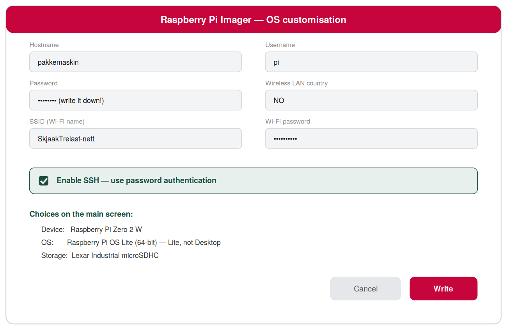
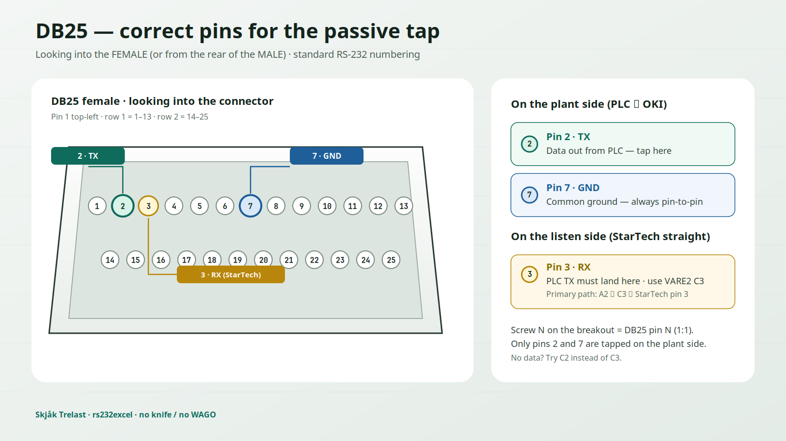

# Installation Guide

Complete walkthrough — from empty SD card to a live passive tap running on the sawmill floor. Roughly 45 minutes, no programming experience required.


The printer keeps printing physical labels **exactly as before**. The tap only listens — it never transmits — so the printer and PLC behave identically whether the Pi is powered or not. **No knife / no WAGO** when using DB25-MG.

---

## 1 · Parts list

| # | Part | Source | Purpose |
|---|------|--------|---------|
| 1 | Raspberry Pi Zero WH | RS 2858711 | Main computer, pre-soldered headers |
| 2 | StarTech ICUSB232DB25 | RS 1238049 | USB → RS-232 DB25 adapter |
| 3 | RS PRO 4-port USB hub | RS 2206492 | Serial adapter + flash drive together |
| 4 | Lexar 32GB Industrial microSDHC | RS 2676402 | System drive — the master copy |
| 5 | 2× Kingston 64GB USB flash | RS 0622158 | Live CSV mirror, pull anytime |
| 6 | RS PRO IP54 enclosure 60×190×110 | RS 1959122 | Sawdust protection |
| 7 | **DB25-MG** female+male + screws (A) | AliExpress | **Tap** — no knife/WAGO |
| 8 | **DB25 female** solder-free terminal (C) | AliExpress | Listen female for StarTech male |
| 9 | DB25 M↔F ribbon 1:1 (B) | AliExpress / have | A → OKI |
| 10 | Micro-USB OTG (male→USB-A female) | AliExpress / have | Pi Zero DATA → hub |
| 11 | OLED JMD0.96D-1 / SSD1306 I2C | AliExpress / have | Status (optional) |
| 12 | Dupont F–F | AliExpress / have | OLED (4 wires) |

Also needed: 5V / ≥2.5 A micro-USB (PWR IN right), two wires A screws 2/7 → C screws 3/7 (StarTech).

See [wiring.md](wiring.md) and [../no/HANDOFF-CLAUDE.md](../no/HANDOFF-CLAUDE.md). **WAGO/cutting is outdated** when using A.

---

## 2 · Flash the SD card (on your Windows/Mac PC)

Download **Raspberry Pi Imager** from [raspberrypi.com/software](https://www.raspberrypi.com/software/), insert the SD card, and configure exactly as shown:



Main screen choices: **Device** = Raspberry Pi Zero **WH** · **OS** = Raspberry Pi OS **Lite (32-bit)** · **Storage** = the Lexar card. Hit the gear icon (or Ctrl+Shift+X) for the customisation screen above, then **Write** (~5 min).

> **Why Lite (32-bit)?** Pi Zero WH has a single-core ARMv6 CPU — 64-bit OS is not supported. No desktop means faster boot, less SD wear, and everything is done over SSH anyway.

---

## 3 · First boot and SSH

1. Insert the SD card into the Pi. Connect power to the port marked **PWR IN**.
2. Wait 1–2 minutes for first boot (green LED settles down).
3. From your PC, on the same network:

```bash
ssh pi@pakkemaskin.local
# or use the IP address from your router's DHCP list:
ssh pi@192.168.1.42
```

Windows without ssh? Install [PuTTY](https://putty.org) or use WSL.

---

## 4 · Install the software

Paste these blocks one at a time into the SSH session:

```bash
# System update (~5 min)
sudo apt update && sudo apt upgrade -y

# Clone the repo
git clone https://github.com/qeamer/rs232excel.git
cd rs232excel/python/en

# Install dependencies and enable autostart
bash install.sh
```

Optional OLED display:

```bash
pip3 install --break-system-packages luma.oled
sudo raspi-config      # Interface Options → I2C → Enable → reboot
python3 vis_status.py  # runs independently of capture
```

---

## 5 · The physical tap (A–G — no knife)

**Stop the machine before touching any cable.** The original plant cable is never modified.

Fasit: [wiring.md](wiring.md) · [../no/HANDOFF-CLAUDE.md](../no/HANDOFF-CLAUDE.md)





> Ignore old text/images with **WAGO**, “cut pins 2/7”, GPIO, or parallel port. Signal → **USB–RS232 → `/dev/ttyUSB0`**.

**Steps:**

1. Insert **A (DB25-MG)** in series: PLC DB25 male → A female; A male → **B** (ribbon) → OKI.  
2. Wire **E1** on A screw **2** (TX); **E2** on A screw **7** (GND).  
3. E1 → **C** (DB25 female terminal) screw **C3** (= StarTech pin 3 RX); E2 → **C7**. No data? Try **C2**.  
4. **D (StarTech)** DB25 male straight into C female.  
5. D USB → hub → OTG → Pi **DATA** (middle). 5V → Pi **PWR IN** (right).

> ⚠ **Direction:** PLC TX → StarTech **RX**. TX→TX captures nothing.

### USB chain


OTG must go in the middle **DATA** port — corner is **PWR IN** only (≥2.5 A).

**Chain:** Pi DATA → OTG USB-A female ← hub male. StarTech DB25 male → C female ← wires from A.

### OLED status display (optional)


Four I2C jumpers (SSD1306 0.96"), independent of the USB chain. Own process (`vis_status.py`) — if it crashes, capture is unaffected. **Not** a 40-pin LCD HAT.

---

## 6 · Verify before going live

**Test 1 — raw capture, nothing saved.** Run a package through the plant and watch:

```bash
cd ~/rs232excel/python/en
python3 read_package.py --raw-capture --port /dev/ttyUSB0
```

Compare against the physical printed label. Garbled output (`6´´ ·5Ø ±50` instead of `645 75X 150`)? The PLC likely uses 7E1 framing:

```bash
python3 read_package.py --raw-capture --parity E --databits 7
```

Nothing at all? Try `--baud 4800`, `2400`, or `19200`, and re-check the pin 2/7 splice.

**Test 2 — real capture.** This is the production command:

```bash
python3 read_package.py --port /dev/ttyUSB0 --usb-mirror /media/usb0
```


Run 2–3 packages, check `packages.csv` against the paper labels, pull the flash drive mid-run (capture continues), re-insert it (missed rows sync automatically).

**Go live.** The service installed in step 4 autostarts on every boot:

```bash
sudo systemctl start read-package
journalctl -u read-package -f     # live log
```

---

## 7 · The result

`--export-xlsx` produces a branded workbook: a **Summary** sheet with totals per sort category, per day/month/year, plus live charts — followed by one sheet per sort category and a **Raw data** sheet. All summary numbers are formulas, so edits to the data recalculate everything.

<p align="center">


</p>


Pull the flash drive at any time — the Excel file and CSV are on it, ready to open on any PC.

---

## 8 · Final checklist

- [ ] All parts received (SD card shipped separately!)
- [ ] A (DB25-MG) in series PLC↔OKI via B
- [ ] C + StarTech (D); E1/E2 on screws 2/7→3/7; secured
- [ ] USB chain: Pi **data port** → OTG → hub → adapter + flash drive
- [ ] OLED on GPIO 1/3/5/6, I2C enabled in raspi-config (if used)
- [ ] `--raw-capture` shows readable label text
- [ ] Live run verified against paper labels
- [ ] Flash drive pulled and re-inserted → rows synced automatically
- [ ] systemd service enabled → survives power loss
- [ ] Excel export opens with Summary, charts, and logo

---

*Questions or a wiring photo that doesn't match these drawings? Open an issue.*

*Norwegian version: [docs/no/INSTALLATION.md](../no/INSTALLATION.md)*
