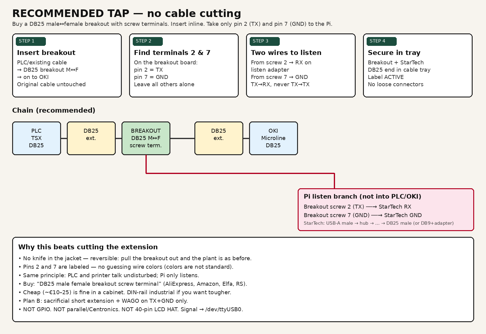
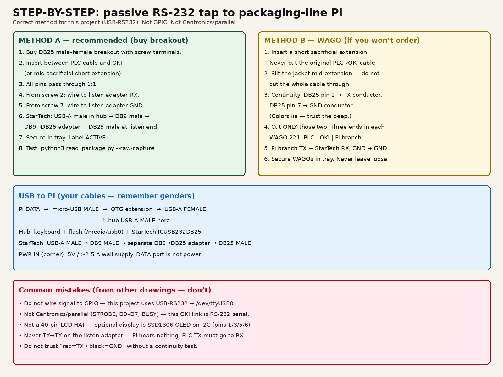

# Wiring





## Recommendation: buy a breakout — don’t cut

| | Method A (recommended) | Method B (works) |
|--|------------------------|------------------|
| Part | **DB25 male↔female breakout** with screw terminals | Short sacrificial extension + **WAGO 221** |
| Work | Insert board inline | Slit jacket, cut only TX+GND |
| Reversible | Yes — unplug the board | Messier |
| Find TX/GND | Labeled **pin 2** and **pin 7** on the board | Continuity test (colors lie) |
| Search | `DB25 male female breakout screw terminal` | — |

Buy two breakouts if you can (one live, one spare). Cheap AliExpress/Amazon units are fine in a cabinet; DIN-rail (e.g. Winford) if you want tougher hardware.

**Not** GPIO. **Not** parallel/Centronics (STROBE/D0…). **Not** a 40-pin LCD HAT. Signal goes to `/dev/ttyUSB0` via USB–RS232.

## What you have

| Part | Connector |
|------|-----------|
| PLC and OKI | **DB25** |
| Extension (middle) | Often a **DB9** cable with **DB25 adapters** on each end |
| Pi OTG extension | micro-USB **male** into Pi DATA → USB-A **female** out |
| USB hub | its USB-A **male** cable into the OTG female |
| StarTech / DB9 cable | USB-A **male** into hub → DB9 **male** + **DB9→DB25 adapter** → DB25 **male** |

| Signal | DB25 (PLC/OKI / breakout) | DB9 (if middle section) |
|--------|---------------------------|-------------------------|
| TX (data PLC→printer) | **2** | **3** |
| GND | **7** | **5** |

## Method A — breakout (recommended)

1. Insert a **DB25 M↔F breakout** between PLC cable and OKI (or mid short sacrificial extension). Original cable untouched.
2. All pins pass through 1:1.
3. From **screw 2 (TX)** → wire to listen adapter **RX**.
4. From **screw 7 (GND)** → wire to listen adapter **GND**.
5. Secure in cable tray. Label ACTIVE.

## Method B — WAGO (if you won’t order)

**Wire colors — do not trust them.** Continuity from DB25 pins **2** and **7**.

1. Insert a short **sacrificial extension**. Never cut the original PLC→OKI cable.
2. Slit the jacket mid-extension — **do not cut the whole cable through**.
3. Cut **only** TX + GND. Three ends in each WAGO 221: PLC | OKI | Pi branch.
4. Pi branch: TX → RX, GND → GND.

```
PLC side ──┐
           ├── WAGO ── printer side
Pi branch ─┘
```

## USB–RS232 (separate branch)


```text
Pi DATA ── micro-USB MALE ── OTG extension ── USB-A FEMALE
                                                    ↑
                              hub USB-A MALE ───────┘
                                    │
                         ├── keyboard
                         ├── flash → /media/usb0
                         └── StarTech / DB9 cable:
                               USB-A MALE into hub
                               → DB9 MALE
                               → DB9→DB25 adapter
                               → DB25 MALE → breakout/WAGO listen
                               → /dev/ttyUSB0
```

| From tap (breakout/WAGO) | To StarTech (serial end) |
|--------------------------|--------------------------|
| TX (DB25 pin 2) | **RX** |
| GND (DB25 pin 7) | **GND** |

TX → RX — never TX to TX.

Older overview (WAGO-focused): [passive-rs232-tap.png](img/passive-rs232-tap.png)

*Norwegian: [docs/no/wiring.md](../no/wiring.md)*
