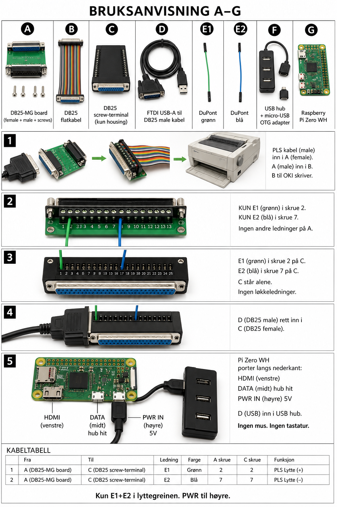

# Handoff til Claude — rs232excel / Pakkemaskin Skriver

**Dato:** 2026-07-25  
**Repo:** https://github.com/qeamer/rs232excel  
**Branch:** `cursor/pakkemaskin-cli-ef03`  
**PR:** https://github.com/qeamer/rs232excel/pull/3  
**Pi hostname:** `pakkemaskin`  
**Produksjonskode:** `python/no/`  
**Kunde/sted:** Skjåk Trelast — pakkelinje (PLS Telemecanique TSX → OKI Microline)

Dette er **fasit**. Stol på A–G-bruksanvisningen og bildene merket «bruk» under. Eldre AI-plakater med WAGO, GPIO, «ELLER»-TTL, løs M↔F-kloss, ekstra blå loop-kabler eller feil Pi-porter er **ugyldige**.

---

## 1. Hva systemet er

Passiv RS-232-lytting PLS → skriver. Pi Zero WH parser pakkelapper til CSV/Excel.

- Fangst skriver først til **SD** (fasit).
- USB-penn speiler `pakkelapperYYYY.csv` / `.xlsx` / `manglerYYYY.csv` på `/media/usb0`.
- Serie: `/dev/ttyUSB0` via USB–RS232 — **ikke GPIO**.
- Valgfri OLED: **JMD0.96D-1** (SSD1306 I2C) — `vis_status.py`.

**CLI:** `start` `stopp` `restart` `status` `logg` `sjekk` `excel` `usb` `integritet` `meny`

```bash
cd ~/rs232excel && git pull
cd python/no
sudo cp pakkemaskin meny /usr/local/bin/
sudo ln -sf /usr/local/bin/pakkemaskin /usr/local/bin/integritet
restart && integritet
```

---

## 2. Deler A–G (nye / faktiske)

| | Del | Status | Rolle |
|--|-----|--------|--------|
| **A** | **DB25-MG** (hunn + hann + skruer 1–25), gjerne DIN-skinne | **Kjøpes** | Anlegg pass-through + tappunkt |
| **B** | DB25 male↔female **color ribbon** (1:1) | **Har allerede** | A-hann → OKI |
| **C** | DB25 **hunn** solder-free terminal (BFS / HD-LINK) | **Kjøpes** | Lytte-hunn: StarTech-hann inn her |
| **D** | **StarTech ICUSB232…** USB→serie + **DB9→DB25-adapter** (DB25 **hann** ute) | **Har allerede** | Lytteadapter → hub → Pi |
| **E1/E2** | To ledninger (male DuPont / avisolert) | **Har** | A-skrue → C-skrue |
| **F** | USB-hub + OTG (micro-USB hann → USB-A hunn) | **Har** | Hub → Pi DATA |
| **G** | Pi Zero WH + 5V ≥2,5 A | **Har** | PWR IN høyre, DATA midt |

**Ikke nødvendig til tapp:** pigtail, ekstra FTDI USB–DB25, WAGO, kniv, 3,5" GPIO-touch (annet prosjekt).

**DuPont F–F:** til **OLED JMD0.96D-1** (4 pinner), ikke kritisk for tapp hvis male/ledning brukes i skruene.

Ingen kniv/WAGO når A brukes.

---

## 3. Bruksanvisning (steg)

```text
1) Anlegg:  PLS DB25 HANN → A HUNN
            A HANN → B (bånd 1:1) → OKI

2) Tapp på A = DB25-MG:
            E1 i A-skrue 2 (TX)
            E2 i A-skrue 7 (GND)

3) Inn på C = DB25 hunn-terminal (lytte):
            E1 → C-skrue 3 (RX; prøv 2 hvis null data)
            E2 → C-skrue 7
            (ingen andre skruer på C)

4) D = StarTech DB25 HANN rett inn i C HUNN
            (E1/E2 sitter fortsatt i C — typisk skrue 3 og 7)

5) Pi G:  5V → PWR IN (HØYRE micro-USB)
          F OTG → DATA (MIDTRE micro-USB)
          D USB-A → hub
```

### Pi Zero porter (venstre → høyre)

1. **HDMI** (helt venstre)  
2. **DATA / OTG** (midt) ← hub  
3. **PWR IN** (helt **høyre**) ← kun 5V  

### Pinner (StarTech = typisk straight / DTE)

| Fra A (anlegg) | Signal | → | Til C (mot D / StarTech) |
|----------------|--------|---|---------------------------|
| skrue **2** | TX | → | skrue **3** (RX) — prøv først* |
| skrue **7** | GND | → | skrue **7** |

\*Bruksanvisningsbildene viser ofte 2→2 som «prøv først» for null modem.  
**Med StarTech (ikke null modem):** start med **A2 → C3**, **A7 → C7**.  
Null data? Bytt bare datapinnen (C2 ↔ C3).

La C-skruer utenom 2/3 og 7 stå **tomme** (ikke koble StarTech TX ut tilbake til anlegget).

---

## 4. Bilder — bruk disse

| Fil | Bruk |
|-----|------|
| [`img/bruksanvisning-tapp-foto.png`](img/bruksanvisning-tapp-foto.png) | **AI-foto bruksanvisning A–G** (primær) |
| [`img/passiv-rs232-tapp.png`](img/passiv-rs232-tapp.png) | Skjema A–G (tekst/steg) |
| [`img/usb-kjede-komplett.png`](img/usb-kjede-komplett.png) | USB-kjønn OTG/hub |
| [`img/oled-i2c-korrekt.png`](img/oled-i2c-korrekt.png) | OLED I2C pin 1/3/5/6 |
| [`docs/no/wiring.md`](wiring.md) | Kort fasit-tekst |




### Ikke bruk som fasit

`tapp-i-inngrep.png`, `tapp-dine-deler.png`, `tapp-alle-metoder.png` (eldre), `oled-gpio.png`, og alt med WAGO-klipp, GPIO, parallellport, «ELLER»/TTL, eller hub i PWR IN.

**Legacy-filer overskrevet med A–G** (gamle raw-URL-er peker nå hit etter merge):  
`signal-flow.png`, `wiring-tap.png` (= `bruksanvisning-tapp-foto.png` / `tap-mated.png`).

Raw:

- https://github.com/qeamer/rs232excel/raw/cursor/pakkemaskin-cli-ef03/docs/no/HANDOFF-CLAUDE.md  
- https://github.com/qeamer/rs232excel/raw/cursor/pakkemaskin-cli-ef03/docs/no/img/bruksanvisning-tapp-foto.png  
- https://github.com/qeamer/rs232excel/blob/cursor/pakkemaskin-cli-ef03/docs/no/wiring.md  

---

## 5. OLED (valgfritt) — JMD0.96D-1

| OLED | Pi |
|------|-----|
| VCC | pin 1 (3V3) |
| SDA | pin 3 |
| SCL | pin 5 |
| GND | pin 6 |

DuPont F–F. Egen prosess — påvirker ikke fangst. **Ikke** 40-pinners LCD-HAT.

---

## 6. Programvare (kort)

| | |
|--|--|
| SD fasit, penn speiler, `integritet` | Ja |
| Årsfiler + auto Excel | Ja |
| Bug D–H | Fikset |
| Wi‑Fi opplasting til intern app | Ikke startet |

Tester: `cd python/no && python3 -m unittest test_register.py`

---

## 7. Instruks til Claude

1. Les denne filen + `wiring.md` før tegning/endring.  
2. Bruk bokstaver **A–G**. Navngi objekter i hvert steg («A = DB25-MG»).  
3. Lyttegrein = **kun E1+E2** mellom A og C, deretter D i C. Ingen ekstra adaptere.  
4. Pi: **PWR til høyre**, DATA midt, HDMI venstre.  
5. Med StarTech: pin **A2→C3**, **A7→C7** først (ikke anta null modem).  
6. Ikke foreslå GPIO / parallell / WAGO-klipp når A finnes.  
7. Endre `docs/no` først, speil `docs/en`. Branch `cursor/…-ef03`, base `main`.  

---

## 8. Sjekkliste montering

- [ ] A mellom PLS og OKI (via B)  
- [ ] E1: A2 → C2 eller C3 (StarTech: start C3)  
- [ ] E2: A7 → C7  
- [ ] D (StarTech DB25 hann) i C hunn  
- [ ] D USB i hub → OTG → G DATA  
- [ ] 5V i G PWR IN (høyre)  
- [ ] `python3 read_package.py --raw-capture --port /dev/ttyUSB0`  

*Slutt på handoff.*
