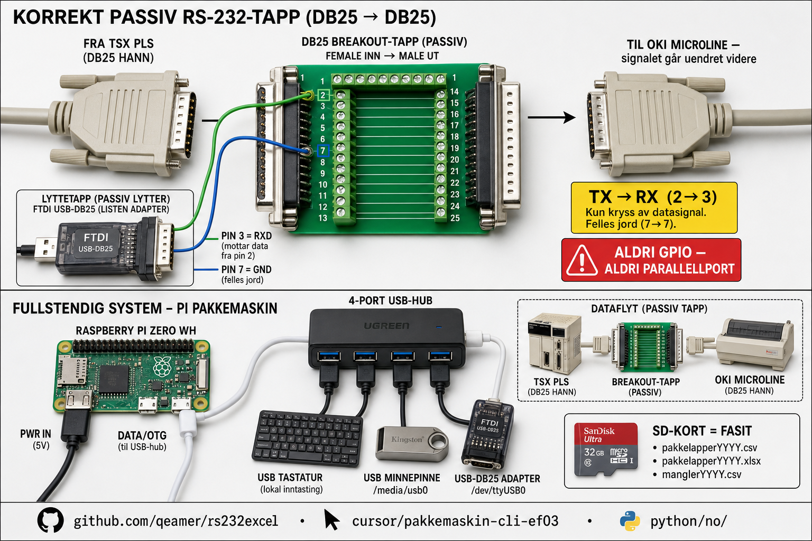
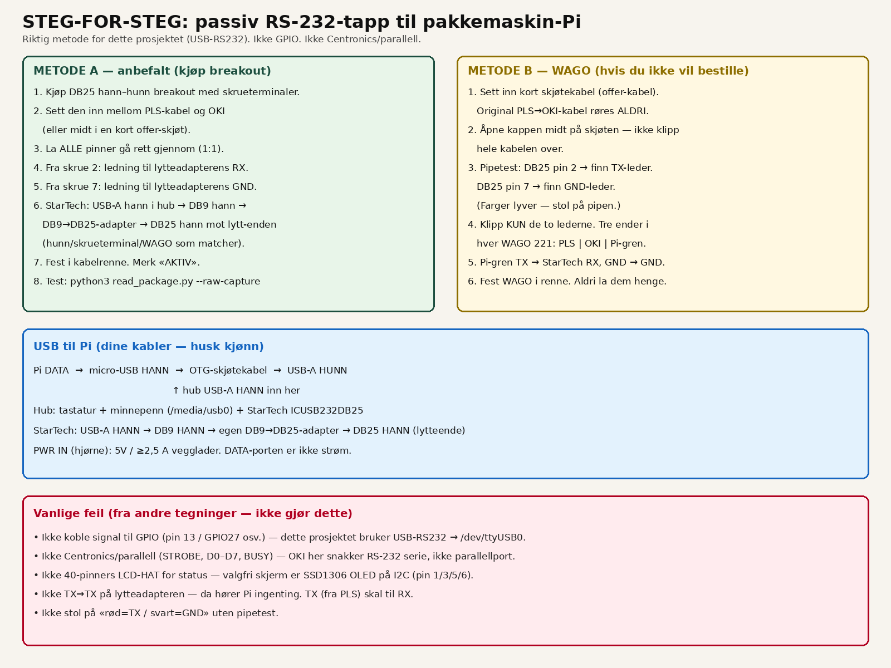

# Handoff til Claude — rs232excel / Pakkemaskin Skriver

**Dato:** 2026-07-24  
**Repo:** https://github.com/qeamer/rs232excel  
**Branch:** `cursor/pakkemaskin-cli-ef03`  
**PR:** https://github.com/qeamer/rs232excel/pull/3  
**Pi hostname:** `pakkemaskin`  
**Produksjonskode:** `python/no/`  
**Kunde/sted:** Skjåk Trelast — pakkelinje (PLS Telemecanique TSX → OKI Microline)

Dette dokumentet er fasit for videre arbeid. **Stol på tabellene og bildene her** — tidligere AI-tegninger hadde feil USB-/DB-kjønn og foreslo GPIO/parallellport.

---

## 1. Hva systemet er

Passiv RS-232-lytting mellom PLS og skriver. Raspberry Pi Zero WH parser pakkelapper til CSV/Excel.

- Fangst skriver **alltid først til SD** (fasit).
- USB-minnepenn speiler årsfiler: `pakkelapperYYYY.csv` / `.xlsx` / `manglerYYYY.csv` på `/media/usb0`.
- Serieport: `/dev/ttyUSB0` via **USB–RS232** — **ikke GPIO**.
- Valgfri OLED: SSD1306 I2C (egen prosess `vis_status.py`).

**CLI på Pi:** `start` `stopp` `restart` `status` `logg` `sjekk` `excel` `usb` `integritet` `meny`

```bash
cd ~/rs232excel && git pull
cd python/no
sudo cp pakkemaskin meny /usr/local/bin/
sudo ln -sf /usr/local/bin/pakkemaskin /usr/local/bin/integritet
restart
integritet
```

---

## 2. Maskinvare-fasit (kjønn og kjede)

### 2.1 Anlegg / tapp (anbefalt — breakout, ingen kniv)

```text
PLS (TSX) DB25 HANN
        ↓
DB25 BREAKOUT (HUNN ← PLS, HANN → skriver, skruer 1–25)
        ↓
skjøtekabel DB25
        ↓
OKI Microline

Fra breakout samtidig:
  skrue 2 (TX)  →  USB–DB25 pin 3 (RX)
  skrue 7 (GND) →  USB–DB25 pin 7 (GND)
        ↓
USB-A → hub → Pi
```






### 2.2 Pinner (viktig — tallene er ulike på hver side)

| Anleggs-breakout | Signal | → | Lytteadapter USB–DB25 |
|------------------|--------|---|------------------------|
| skrue **2** | TX (PLS→skriver) | → | pin **3** (RX) |
| skrue **7** | GND | → | pin **7** (GND) |

- **2 → 3**, ikke 2 → 2 (TX→RX).
- Breakout skrue **3** (RX andre veien) skal **ikke** tappes til Pi.
- Lytteadapter pin **2** (TX ut) skal **ikke** kobles.
- Null data? Prøv bytt 2↔3 **bare på lytteenden** (noen adaptere er DCE).

**Inn i lytteadapter:** USB–DB25 **hann** i egen DB25-**hunn** med skruer (eller DuPont-hunn). Ledninger til skrue/ledning **3** og **7**.

### 2.3 USB til Pi (faktiske kabler fra bilder)

```text
Pi DATA ── micro-USB HANN ── OTG-skjøtekabel ── USB-A HUNN
                                                    ↑
                              hubens USB-A HANN ────┘
                                    │
                         ├── USB-tastatur
                         ├── minnepenn → /media/usb0
                         └── USB–DB25 → /dev/ttyUSB0
```

- **PWR IN** (hjørne): 5V / ≥2,5 A vegglader — kun strøm.
- **DATA** (midt): OTG — ikke strømporten.
- OTG er **hunn** ute; hub er **hann** inn.
- StarTech ICUSB232DB25 (evt. DB9 + DB9→DB25-adapter) kan fylle USB–DB25-rollen.


### 2.4 OLED (valgfritt)

SSD1306 0,96" I2C — **ikke** 40-pinners LCD-HAT.

| OLED | Pi-pin |
|------|--------|
| VCC | 1 (3V3) |
| SDA | 3 |
| SCL | 5 |
| GND | 6 |


---

## 3. Det Claude / assistent IKKE skal gjøre

- Ikke foreslå **GPIO** for RS-232-signal (ødelegger Pi — ±V vs 3,3 V).
- Ikke **Centronics/parallell** (STROBE, D0–D7, BUSY) — dette er **serie RS-232**.
- Ikke 40-pinners **LCD-HAT** som statusskjerm (bruk I2C OLED).
- Ikke tegn OTG som hann–hann; ikke tegn StarTech som «DB9 hunn» uten foto.
- Ikke stol på trådfarger («rød=TX») uten pipetest / merkede breakout-skruer.
- Ikke klipp original PLS→OKI-kabel — bruk breakout eller offer-skjøt.

---

## 4. Programvare-status (2026-07-24)

| Område | Status |
|--------|--------|
| HDMI-meny + ettords-kommandoer | På branch / i bruk på Pi |
| USB auto-mount `/media/usb0`, hotplug | Ja |
| Årsfiler + auto Excel-speil | Ja |
| `integritet` / fsync / atomisk heal | Ja |
| Bug D–H (runde-reset, flush, manuell→ekte, mangler) | Fikset + tester |
| Docs: breakout-anbefaling, pinner 2→3 / 7→7 | Ja |
| Wi‑Fi opplasting til intern app | **Ikke gjort** (ønsket senere) |
| OLED fysisk på Pi | Ofte ikke koblet ennå (`i2cdetect` tom = OK) |

Tester:

```bash
cd python/no && python3 -m unittest test_register.py
```

Viktige filer:

| Fil | Rolle |
|-----|--------|
| `python/no/read_package.py` | Fangst / parse |
| `python/no/pakkemaskin` | CLI |
| `python/no/meny` | HDMI-meny |
| `python/no/vis_status.py` | OLED |
| `docs/no/wiring.md` | Koblingsfasit |
| `docs/no/INSTALLATION.md` | Installasjon + delerliste |
| `CHANGELOG.md` | Dagens logg |

---

## 5. Deler eier kjøper / har

| Del | Merknad |
|-----|---------|
| DB25 M↔F breakout m/skruer | **Anbefalt tapp** — PLS hann rett inn |
| Evt. DB25-hunn breakout / DuPont | Mot USB–DB25 hann (lytteende) |
| USB–DB25 (ny eller StarTech ICUSB232DB25) | På huben |
| Pi Zero WH, hub, OTG (hunn), tastatur, minnepenn | På plass |
| WAGO / offer-skjøt | Plan B hvis breakout ikke brukes |

---

## 6. Alle norske illustrasjoner (bruk disse)

Hovedbildene ligger også inne i §2. Her er full liste med filsti:

### Fasit (2026-07-25) — foto-realistisk stil

Claude/Gemini-innhold (breakout, **2→3 / 7→7**) tegnet om med nesten-ekte komponentfoto.

**passiv-rs232-tapp.png** — hovedplakat breakout + systemarkitektur  


**usb-kjede-komplett.png** — OTG hunn, hub hann, lyttekabel  


**tapp-anbefalt-breakout.png** — hvorfor breakout  


**tapp-steg-for-steg.png** — metode A/B + vanlige feil  


**oled-i2c-korrekt.png** — I2C fire ledninger  


### Støttebilder

| Fil | Innhold |
|-----|---------|
| `img/signal-flow.png` | Signalflyt (eldre) |
| `img/pi-imager-setup.png` | Pi Imager-oppsett |
| `img/terminal-capture.png` | Terminalfangst |
| `img/excel-summary.png` | Excel-oppsummering |
| `img/excel-charts.png` | Excel-grafer |


**Eldre / unngå som fasit:** `img/wiring-tap.png`, `img/usb-chain.png`, `img/oled-gpio.png`.

Engelske speil: `docs/en/img/` (`passive-rs232-tap.png`, `usb-chain-complete.png`, `tap-recommended-breakout.png`, `tap-step-by-step.png`, `oled-i2c-correct.png`, …).

**Raw på branch:**

- https://github.com/qeamer/rs232excel/raw/cursor/pakkemaskin-cli-ef03/docs/no/HANDOFF-CLAUDE.md  
- https://github.com/qeamer/rs232excel/raw/cursor/pakkemaskin-cli-ef03/docs/no/img/passiv-rs232-tapp.png  
- https://github.com/qeamer/rs232excel/blob/cursor/pakkemaskin-cli-ef03/docs/no/HANDOFF-CLAUDE.md  

Eldre PDF (delvis utdatert pin-tekst): `docs/no/rs232excel-2026-07-24-for-claude.pdf` — **bruk denne markdown-filen som fasit**.

---

## 7. Instruks til neste assistent (Claude)

1. Les denne filen + `docs/no/wiring.md` før du tegner eller endrer kobling.
2. Endre helst **norsk docs først**, speil til `docs/en/`.
3. Arbeid på branch `cursor/pakkemaskin-cli-ef03` (eller ny `cursor/…-ef03`); base `main`.
4. Etter kode: tester i `python/no`, commit, push, oppdater PR #3.
5. Pi-oppdatering: `git pull` + kopier `pakkemaskin`/`meny` + `restart` + `integritet`.
6. Fremtid: Wi‑Fi-opplasting av Excel til intern Trelast/Høvelapp-app — ikke startet.

---

## 8. Kort sjekkliste før ny tap-installasjon

- [ ] Breakout: PLS DB25 hann i hunn-side  
- [ ] Skjøt breakout → OKI  
- [ ] Ledning breakout **2 →** lytteadapter **3 (RX)**  
- [ ] Ledning breakout **7 →** lytteadapter **7 (GND)**  
- [ ] USB–DB25 i hub; hub hann i OTG hunn; OTG i Pi **DATA**  
- [ ] Strøm i **PWR IN** ≥2,5 A  
- [ ] `python3 read_package.py --raw-capture --port /dev/ttyUSB0` viser lapptekst  

*Slutt på handoff.*
