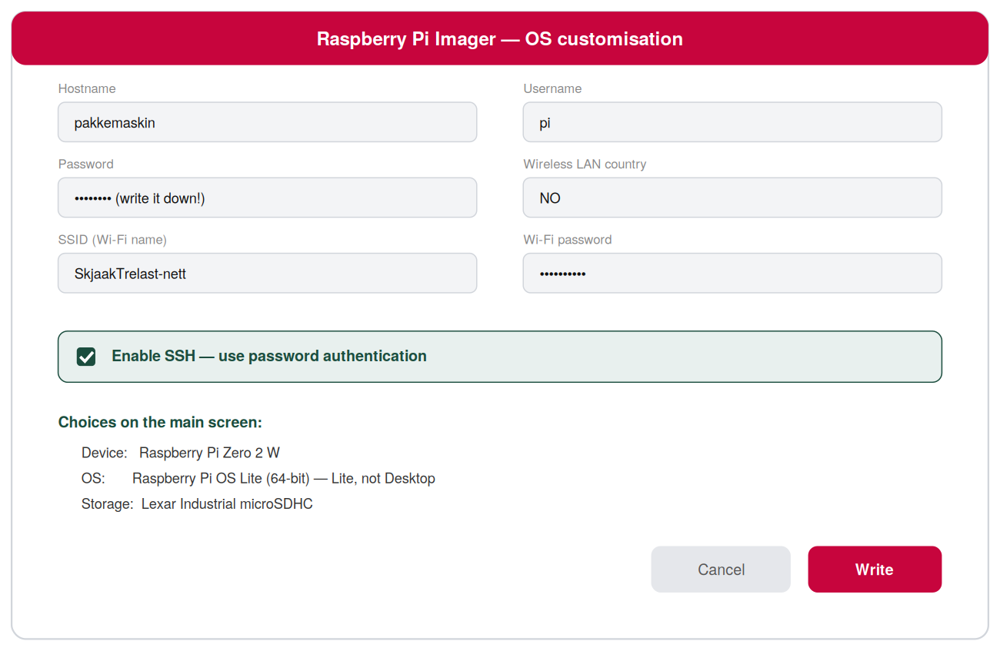
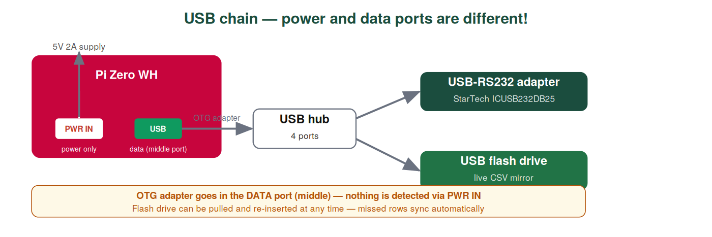
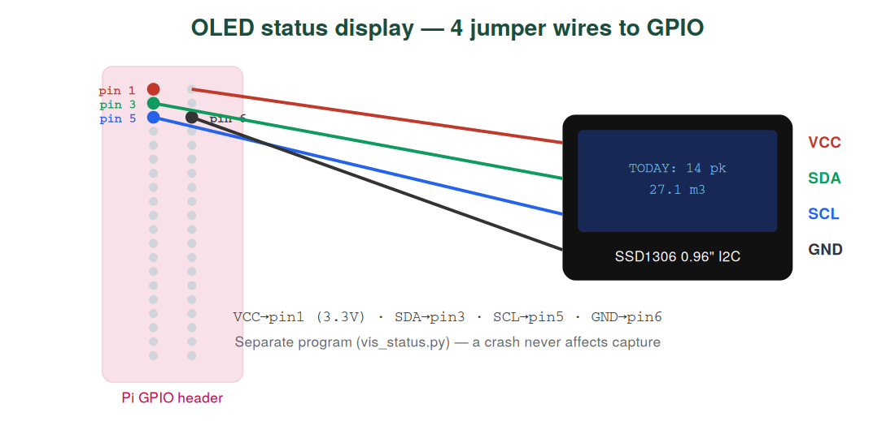

# Installasjonsguide

Komplett gjennomgang — fra tom SD-kort til fangst i produksjon på høvleriet. Ca. 45 minutter, ingen programmeringserfaring nødvendig.


Skriveren fortsetter å skrive fysiske pakkelapper **helt som før**. Tappen lytter bare — den sender aldri — så skriver og PLS oppfører seg likt uansett om Pi-en er påslått eller ikke.

---

## 1 · Deler

| # | Del | Kilde | Formål |
|---|-----|-------|--------|
| 1 | Raspberry Pi Zero WH | RS 2858711 | Hoveddatamaskin, ferdig loddet header |
| 2 | StarTech ICUSB232DB25 | RS 1238049 | USB → RS-232 DB25 adapter |
| 3 | RS PRO 4-port USB-hub | RS 2206492 | Serieadapter + minnepenn samtidig |
| 4 | Lexar 32GB Industrial microSDHC | RS 2676402 | Systemdisk — fasiten |
| 5 | 2× Kingston 64GB USB-minnepenn | RS 0622158 | Sanntidsspeiling av CSV |
| 6 | RS PRO IP54 kapsling 60×190×110 | RS 1959122 | Støvbeskyttelse |
| 7 | WAGO 221-412 klemmer, 10-pk | RS 8837544 | Verktøyfri avgrening |
| 8 | DB25 hann→hunn skjøtekabel 40 cm | AliExpress | **AKTIV** tapp-kabel |
| 9 | DB25 hann→hunn skjøtekabel 50 cm | AliExpress | Reserve — merk med tape |
| 10 | Micro-USB OTG adapter | AliExpress | Pi Zero → hub |
| 11 | SSD1306 0,96" OLED, I2C, 4-pin | AliExpress | Statusskjerm (valgfritt) |
| 12 | Dupont hopperledninger F-F | AliExpress | 4 av 40 brukes (OLED) |

I tillegg: 5V/2A+ micro-USB strømforsyning, tynn ledning til WAGO-grenen.

---

## 2 · Flash SD-kortet (på Windows/Mac)

Last ned **Raspberry Pi Imager** fra [raspberrypi.com/software](https://www.raspberrypi.com/software/), sett inn SD-kortet, og konfigurer som vist:



Hovedvalg: **Device** = Raspberry Pi Zero **WH** · **OS** = Raspberry Pi OS **Lite (32-bit)** · **Storage** = Lexar-kortet. Trykk tannhjul (eller Ctrl+Shift+X) for tilpasningsskjermen, deretter **Write** (~5 min).

> **Hvorfor Lite (32-bit)?** Pi Zero WH har ARMv6 — 64-bit OS støttes ikke. Uten skrivebord: raskere oppstart, mindre slitasje på SD-kortet, alt gjøres over SSH uansett.

---

## 3 · Første oppstart og SSH

1. Sett SD-kortet i Pi-en. Koble strøm til porten merket **PWR IN**.
2. Vent 1–2 minutter (grønt LED roer seg).
3. Fra PC-en på samme nettverk:

```bash
ssh pi@pakkemaskin.local
# eller IP fra ruteren:
ssh pi@192.168.1.42
```

Windows uten ssh? [PuTTY](https://putty.org) eller WSL.

---

## 4 · Installer programvaren

Lim inn disse blokkene én om gangen i SSH:

```bash
# Systemoppdatering (~5 min)
sudo apt update && sudo apt upgrade -y

# Klon repoet
git clone https://github.com/qeamer/rs232excel.git
cd rs232excel/python/no

# Avhengigheter og autostart
bash installer.sh
```

Valgfri OLED-skjerm:

```bash
pip3 install --break-system-packages luma.oled
sudo raspi-config      # Interface Options → I2C → Enable → reboot
python3 vis_status.py  # kjører uavhengig av fangst
```

---

## 5 · Fysisk tapping

**Stopp maskinen før du rører kabler.** Originalkabelen endres aldri — 40 cm skjøtekabelen settes **i serie** ved skriveren og kan fjernes på sekunder.

Se også: [wiring.md](wiring.md)


Steg for steg:

1. **Sett inn 40 cm skjøtekabel** mellom skriverens DB25 og eksisterende kabel fra sorteringsanlegget. Ta bilde av originaltilkoblingen først.
2. **Midt på kabelen**, finn trådene for **pinne 2 (TX)** og **pinne 7 (GND)**. Fotografer fargekoding før klipping.
3. **Klipp kun disse to trådene** — aldri hele kabelen.
4. **WAGO: tre ender per klemme** — PLS-side + skriver-side (signalet går ubrutt) + ny tynn ledning til USB-serieadapter.
5. **Fest skjøten** med strips i kabelrenna — la aldri WAGO henge løst. Merk aktiv kabel med tape.

> ⚠ **Retning teller:** pinne 2 fra skriversiden er **TX** (signalkilden). Den kobles til adapterens **RX**. TX→TX fanger ingenting.

### USB-kjede



OTG-adapteren **må** i **data**-porten midt på Pi Zero — hjørneporten er kun strøm.

### OLED statusskjerm (valgfritt)



Fire hopperledninger, helt uavhengig av USB-kjeden. Eget program — krasjer den, påvirkes ikke fangsten.

---

## 6 · Verifiser før produksjon

**Test 1 — bare fangst, ingenting lagres.** Kjør en pakke gjennom anlegget:

```bash
cd ~/rs232excel/python/no
python3 read_package.py --bare-fangst --port /dev/ttyUSB0
```

Sammenlign med den trykte lappen. Rart tegn (`6´´ ·5Ø ±50` i stedet for `645 75X 150`)? PLS bruker sannsynligvis 7E1:

```bash
python3 read_package.py --bare-fangst --paritet E --databits 7
```

Ingenting i det hele tatt? Prøv `--baud 4800`, `2400`, eller `19200`, og sjekk pin 2/7-skjoeten.

**Test 2 — ekte fangst.** Produksjonskommando:

```bash
python3 read_package.py --port /dev/ttyUSB0 --usb-sti /media/usb0
```


Kjør 2–3 pakker, sjekk `pakkelapper.csv` mot papirlappene, trekk ut minnepennen midt i kjøring (fangst fortsetter), sett den inn igjen (manglende rader synkes).

**Produksjon.** Tjenesten fra steg 4 starter automatisk ved boot:

```bash
sudo systemctl start pakkemaskin-skriver
journalctl -u pakkemaskin-skriver -f     # live logg
```

---

## 7 · Resultatet

`--eksporter-xlsx` lager en merket arbeidsbok: **Sammendrag**-ark med totaler per sort, per dag/måned/år, pluss grafer — deretter ett ark per sortkategori og **Rådata**-ark. Alle summer er formler mot rådata.

<p align="center">


</p>

Trekk ut minnepennen når som helst — Excel og CSV ligger klare på PC.

---

## 8 · Sjekkliste

- [ ] Alle deler mottatt (SD-kort sendes separat!)
- [ ] 40 cm kabel merket AKTIV, 50 cm merket RESERVE
- [ ] Tap skjøtet: pin 2+7 WAGO, festet med strips
- [ ] USB-kjede: Pi **data-port** → OTG → hub → adapter + minnepenn
- [ ] OLED på GPIO 1/3/5/6, I2C aktivert (hvis brukt)
- [ ] `--bare-fangst` viser lesbar lappetekst
- [ ] Live kjøring verifisert mot papirlapper
- [ ] Minnepenn ut/inn → rader synket
- [ ] systemd-tjeneste aktivert → overlever strømbrudd
- [ ] Excel-eksport med Sammendrag, grafer og logo

---

*Spørsmål eller koblingsbilde som ikke stemmer? Åpne en issue.*

*English version: [docs/en/INSTALLATION.md](../en/INSTALLATION.md)*
