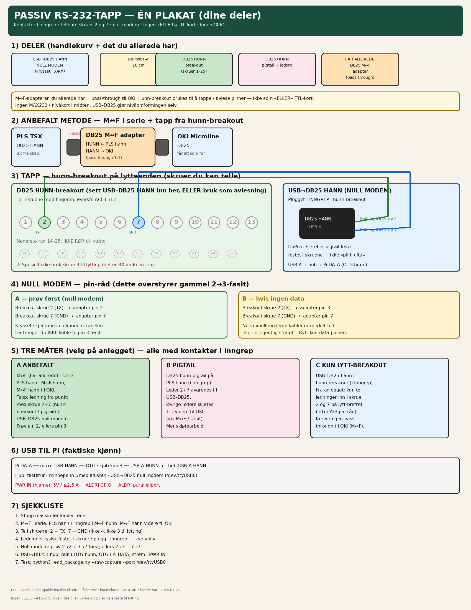
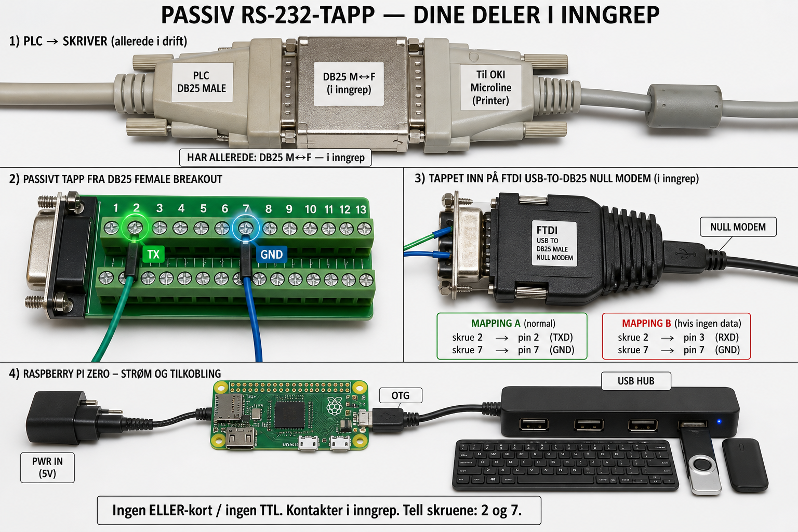

# Kobling





## Deler

| Del | Status |
|-----|--------|
| **DB25 M↔F adapter** | **Har allerede** — pass-through PLS→OKI |
| USB→DB25 **hann**, **null modem** | Handlekurv — lytteadapter |
| DB25 **hunn**-breakout m/skruer | Handlekurv — tellbare pinner 2 og 7 |
| DuPont F–F 10 cm | Handlekurv |
| DB25 hunn-pigtail | Handlekurv — alternativ avgrening |

**Ingen** TTL/MAX232-«ELLER»-kort. USB–DB25 gjør nivåomformingen.

## Anbefalt (kontakter i inngrep)

1. **PLS DB25 hann** plugget **i inngrep** i M↔F **hunn**.
2. M↔F **hann** videre til **OKI** (1:1 pass-through).
3. Fra linja: ledninger i **skrue 2 (TX)** og **skrue 7 (GND)** på hunn-breakout (tell 1→2 og 1→7).
4. USB→DB25 **hann** plugget **i inngrep** i hunn-breakout (eller ledninger festet i skruene).
5. USB-A → hub → Pi DATA (OTG hunn ← hub hann).

### Null modem (overstyrer gammel 2→3-fasit)

| | Breakout | → | USB–DB25 |
|--|----------|---|----------|
| **A først** | skrue **2** TX | → | pin **2** |
| | skrue **7** GND | → | pin **7** |
| **B hvis null data** | skrue **2** TX | → | pin **3** |
| | skrue **7** GND | → | pin **7** |

Ikke bruk skrue **3** til lytting. Ikke GPIO.

## Tre metoder (se plakat)

- **A** — M↔F i serie + tapp 2/7 (anbefalt; du har M↔F)
- **B** — hunn-pigtail på PLS, gren 2/7, resten til OKI
- **C** — hunn-breakout kun på lytteenden; egen pass-through til OKI

## USB

```text
Pi DATA ── OTG (USB-A HUNN) ← hub (USB-A HANN)
                              ├── tastatur
                              ├── minnepenn → /media/usb0
                              └── USB→DB25 null modem → /dev/ttyUSB0
```

Test: `python3 read_package.py --raw-capture --port /dev/ttyUSB0`

*English: [docs/en/wiring.md](../en/wiring.md)*
