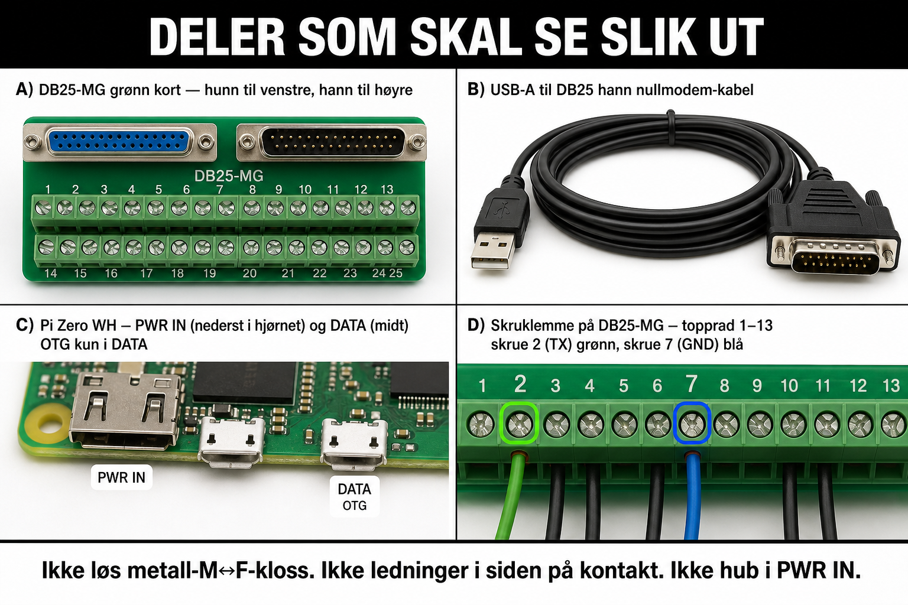

# Kobling




## Midtpunktet: DB25-MG (ikke en løs «M↔F-kloss»)

Du har **DB25-MG Ver 1.1**: grønt board med **HUNN + HANN + skrueterminaler 1–25**.  
Det er både pass-through *og* tapp. Det er **ikke** en separat metall-gender-changer tegnet «i inngrep» mellom to tilfeldige kabler.

```text
PLS DB25 HANN  ──i inngrep──►  DB25-MG HUNN
                                    │
                                    ├── alle pinner 1:1 ──► DB25-MG HANN ──► skjøt/bånd ──► OKI
                                    │
                                    └── skrue 2 (TX) + skrue 7 (GND) ──ledninger──► lytteende
```

## Lytteende

| Del | Rolle |
|-----|--------|
| USB→DB25 **hann**, **null modem** | Inn i en **DB25 hunn** (skruer eller hunn-ende av bånd) |
| Ledning fra MG-skrue **2** | Til lytte-hunn pin **2** (prøv først) eller **3** |
| Ledning fra MG-skrue **7** | Til lytte-hunn pin **7** |
| USB-A | Inn i **USB-hub** → OTG **hunn** → Pi **DATA** (midtre micro-USB) |

Ledninger festes i **skruer / hunn-pinner**. Ikke stikk dem inn i siden på metalskallet.

### Null modem

| | MG-skrue | → | USB–DB25 |
|--|----------|---|----------|
| **A først** | 2 TX | → | pin **2** |
| | 7 GND | → | pin **7** |
| **B hvis null data** | 2 TX | → | pin **3** |
| | 7 GND | → | pin **7** |

## Pi-porter

| Port | Bruk |
|------|------|
| **PWR IN** (hjørne) | Kun 5V / ≥2,5 A vegglader |
| **DATA** (midt) | OTG micro-USB → USB-A hunn ← hub hann |

Hub: USB→DB25 (+ evt. minnepenn). Tastatur valgfritt — ikke nødvendig på koblingsplakat.

## Ikke

- GPIO / parallellport / TTL-«ELLER»-kort  
- Hub eller OTG i PWR IN  
- Fantasi-strømplugger  

Test: `python3 read_package.py --raw-capture --port /dev/ttyUSB0`

*English: [docs/en/wiring.md](../en/wiring.md)*
